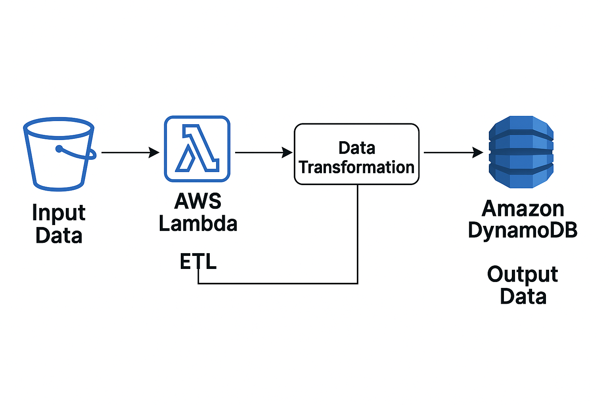

# 🛠️ Serverless Product Catalog ETL Pipeline

This project demonstrates a serverless ETL pipeline where product data in JSON format is uploaded to an AWS S3 bucket, processed via AWS Lambda, and stored in DynamoDB.

---

## 📌 Use Case

A company receives product information from suppliers as JSON files. These files are uploaded to an S3 bucket, where a Lambda function is triggered to clean and load the data into a DynamoDB table.

---

## ⚙️ Architecture





---

## 📁 Sample Input (JSON line format)

```
{
  "product_id": "1001",
  "name": "Chocolate Bar",
  "price": 2.5,
  "category": "snacks",
  "stock": 50,
  "added_on": "2025-06-15T12:00:00Z"
}
```

---

## 🧪 Output

Stored in DynamoDB table `ProductCatalog` with the following schema:

- `product_id` (Partition Key)
- `name`
- `price`
- `category`
- `stock`
- `added_on`

---

## ✅ Step-by-Step Setup

### 1. Create S3 Bucket
- Go to AWS S3 → Create bucket (e.g., `product-etl-input`)
- Upload `.json` files with line-delimited product entries

### 2. Create DynamoDB Table
- Table name: `ProductCatalog`
- Partition key: `product_id` (String)

### 3. Create IAM Role for Lambda
- Trusted entity: Lambda
- Attach policies:
  - `AmazonS3ReadOnlyAccess`
  - `AmazonDynamoDBFullAccess`
  - `AWSLambdaBasicExecutionRole`

### 4. Create Lambda Function
- Runtime: Python 3.11
- Assign IAM Role
- Paste the following handler code:

```python
import json
import boto3

dynamodb = boto3.resource('dynamodb')
table = dynamodb.Table('ProductCatalog')

def lambda_handler(event, context):
    s3 = boto3.client('s3')

    for record in event['Records']:
        bucket = record['s3']['bucket']['name']
        key = record['s3']['object']['key']

        response = s3.get_object(Bucket=bucket, Key=key)
        content = response['Body'].read().decode('utf-8')

        for line in content.strip().splitlines():
            item = json.loads(line)
            table.put_item(Item=item)

    return {"statusCode": 200, "body": "Data inserted successfully"}
```

### 5. Add S3 Trigger to Lambda
- Trigger type: S3
- Bucket: `product-etl-input`
- Event type: `PUT`
- Suffix: `.json`

---

## 🔍 Testing

1. Upload a file like `sample_product_data.json` to your S3 bucket.
2. Go to DynamoDB → Table → Explore Table Items → Verify data.
3. Use CloudWatch Logs to debug Lambda if needed.

---

## 📦 Extensions

- Add schema validation for incoming JSON.
- Use AWS Glue instead of Lambda for heavier transformations.
- Trigger SNS for success/failure notifications.

